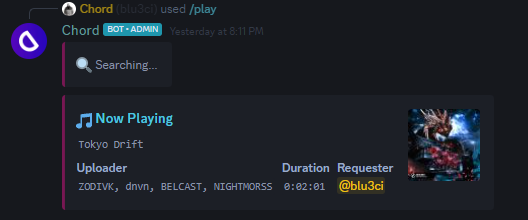
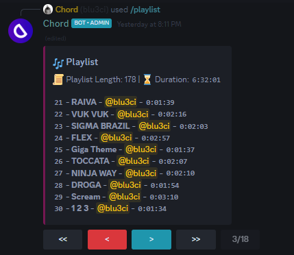
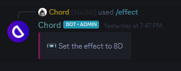

<h1 align="center"></h1>
<h1 align="center">ChordV3</h1>
<p align="center">Made with Python 3.11.1</p>

## ✨ Features
- 🎵 Play music from Spotify & YouTube
- ✅ Support for slash commands
- 👍 Easy to install and deploy
- ⚡ Very fast
- 🪄 Audio effects built in
- 🔀 Support for a variety of playback controls
- 📃 State of the art lyrics searching (finds lyrics to 99% of songs with accurate results)

## 📝 Install
### Recommended Version: Python 3.11.1
1. Clone the git repository with git
```
git clone https://github.com/blu3ci/ChordV3.git
```

2. Create a .env file and copy and paste the contents within the .env.example file

Example: 
```env
# Discord bot token https://discord.com/developers/applications
BOT_TOKEN=

# Spotify client id and client secret https://developer.spotify.com/
SPOTIFY_CLIENT_ID=
SPOTIFY_CLIENT_SECRET=
```

3.  Install poetry
```
pip install poetry
```

4.  Install the project dependencies
```
poetry install
```

5. Enter the poetry virtual environment
```
poetry shell
```

6. Install FFMPEG and put the file in the bin folder or add it to path (specify the installation dir in the config/config.py file)

```python
...
FFMPEG_EXEC_LOCATION = f"{os.getcwd()}\\bin\\ffmpeg.exe"  # install dir (use ffmpeg if added to path)
...
```
    

7. Run the main.py file
```
python main.py
```

8. Extra config options are found in the config folder

## 📸 Screenshots




#### Made with ❤️ by blu3ci
